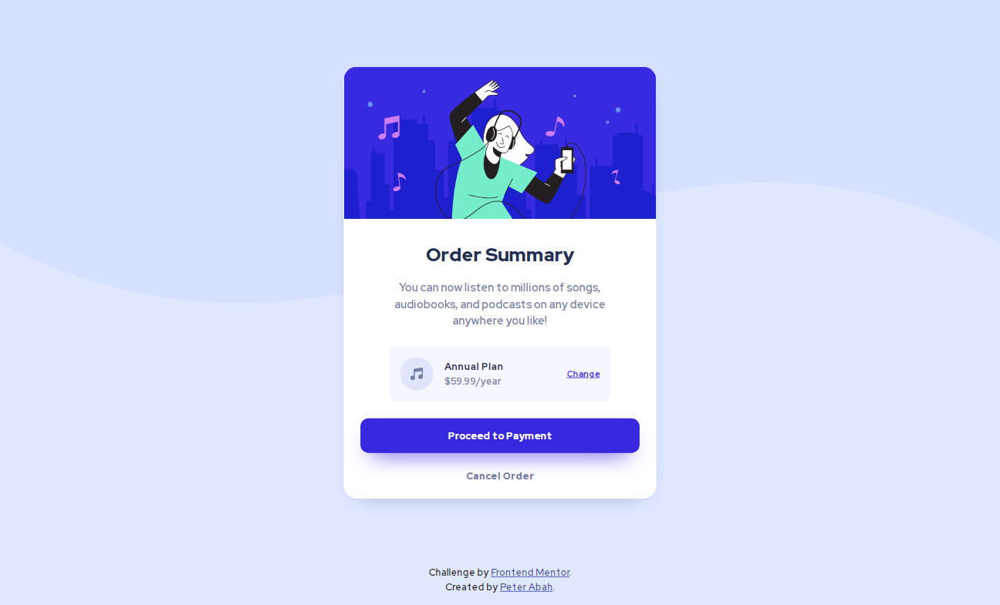
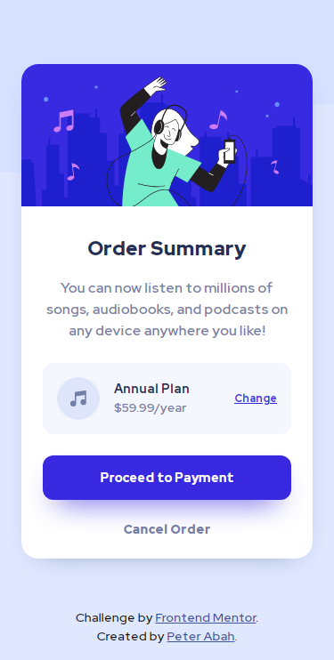

# Frontend Mentor - Order summary card solution

This is a solution to the [Order summary card challenge on Frontend Mentor](https://www.frontendmentor.io/challenges/order-summary-component-QlPmajDUj). 

## Table of contents

- [Overview](#overview)
  - [The challenge](#the-challenge)
  - [Screenshot](#screenshot)
  - [Links](#links)
- [My process](#my-process)
- [Author](#author)

## Overview

### The challenge

Users should be able to:

- See hover states for interactive elements
- The site must closely resemble the design

### Screenshot
#### Desktop view

#### Mobile view

### Links
- Solution URL: [Solution on Frontend Mentor](https://www.frontendmentor.io/solutions/order-summary-card-jvYxz80fv)
- Live Site URL: [Live site](https://peter-abah.github.io/order-summary-card/)

## My process
I built the page using a Mobile-first workflow to ensure responsiveness across all devices

## Author
- Frontend Mentor - [@peter-abah](https://www.frontendmentor.io/profile/peter-abah)
- Twitter - [@iamabah1](https://www.twitter.com/iamabah1)
